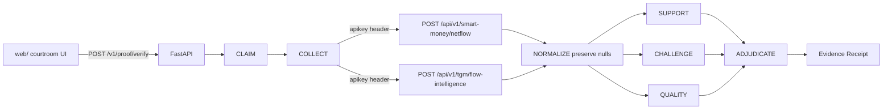

# Singulant Proof

**Don't ask AI to confirm your thesis. Make it try to break it.**

Adversarial verification of one on-chain claim, using Nansen Smart Money netflow and Token God Mode flow-intelligence. Built for the **Nansen Meridian Buildathon 2026**.

V1 claim only:

> Smart Money is accumulating this token.

The product is a courtroom, not a copilot. Support builds the case. Challenge tries to break it. A conservative adjudicator stamps a verdict. **Powered by Nansen.**

This repository is a public Buildathon surface. It has **zero** imports or coupling to AI4 telegram TX, authorize/consume, handoff, V07, or R3. No trading, wallet, or transaction-authorization path.

## Install

Python 3.11+.

```bash
python -m venv .venv
source .venv/bin/activate
pip install -e ".[dev]"
cp .env.example .env
# put NANSEN_API_KEY in .env — never commit it
```

## Environment

| Variable | Required | Purpose |
| --- | --- | --- |
| `NANSEN_API_KEY` | For live verify | Sent as the `apikey` header to `https://api.nansen.ai` |
| `SINGULANT_PROOF_ALLOW_DEMO` | Optional | Allows `{"demo": true}` so the UI can run a labeled synthetic docket without a live call |

Do not put keys in code, fixtures, README, logs, or commits. The live integration test **skips** unless `NANSEN_API_KEY` is set.

## Run the API

```bash
export $(grep -v '^#' .env | xargs)
uvicorn singulant_proof.api.app:app --reload --host 127.0.0.1 --port 8000
```

- `GET /healthz`
- `POST /v1/proof/verify`

## Open the web UI

With the API running, open [http://127.0.0.1:8000](http://127.0.0.1:8000).

You can also open `web/index.html` directly and set **API base** to `http://127.0.0.1:8000`.

CTA: **ATTEMPT FALSIFICATION**. Stages map to the real pipeline: `CLAIM → COLLECT → NORMALIZE → SUPPORT → CHALLENGE → QUALITY → ADJUDICATE → RECEIPT`.

Without a key, check **Synthetic docket** (requires `SINGULANT_PROOF_ALLOW_DEMO=1`).

## Tests

```bash
pytest
```

Live Nansen integration (parent only — do not run the 1,000-call corpus):

```bash
NANSEN_API_KEY=... pytest tests/test_integration_live.py -q
```

`scripts/nansen_eval.py` is a **stub**. Do not execute an evaluation corpus from this repo.

## Architecture



Nansen is the only provider. Credit and rate-limit headers are stored as redacted provenance. Raw provider bodies are never returned.

## Endpoints used

| Provider | Method | Path | Role |
| --- | --- | --- | --- |
| Nansen | POST | `/api/v1/smart-money/netflow` | Primary accumulation evidence + `market_cap_usd` / `trader_count` / `token_age_days` context |
| Nansen | POST | `/api/v1/tgm/flow-intelligence` | Cohort support and challenge (`smart_trader`, `top_pnl`, `whale`, `exchange`, `fresh_wallets`, `public_figure`) |

Auth: header `apikey`. Base: `https://api.nansen.ai`. Client retries **429 / timeout / 5xx** only, with bounded exponential backoff.

Token screener (`/api/token-screener`) is a 404 — not used. V1 takes market-cap context from the netflow row.

## Scoring

Documented in [`src/singulant_proof/proof/scoring.md`](src/singulant_proof/proof/scoring.md).

- Nested netflow windows (`1h ⊂ 24h ⊂ 7d ⊂ 30d`) are **not** added as independent dollars.
- TGM `smart_trader` corroborates Smart Money; it is not summed with netflow.
- Independent cohorts use **max, not sum**.
- Nulls stay null.
- Challenge may conclude **NO MATERIAL CONTRADICTORY EVIDENCE DETECTED**.
- Verdicts: `SUPPORTED` · `SUPPORTED_BUT_CONTESTED` · `MIXED` · `CONTRADICTED` · `INSUFFICIENT_DATA`.
- Same `EvidenceSet` → identical scores and verdict.

## API response

`POST /v1/proof/verify`

```json
{
  "chain": "ethereum",
  "token_address": "0x7fc66500c84a76ad7e9c93437bfc5ac33e2ddae9",
  "claim": "SMART_MONEY_IS_ACCUMULATING_THIS_TOKEN",
  "timeframe": "1d",
  "demo": false
}
```

Response includes `claim`, `chain`, `token`, `stages_completed`, `support_case[]`, `challenge_case[]`, `support_strength`, `challenge_strength`, `data_quality`, `verdict`, `evidence_receipt`, `warnings`.

The evidence receipt is share-card-ready (`claim`, verdict, scores, `observed_at`, observation counts, attribution). There is no social share UI in V1.

## Limitations

- One claim. No freeform NL.
- No trading, wallets, TX auth, or contract calls.
- `exchange_wallet_count` is always 0; `fresh_wallets_*` only on `1d`/`7d`.
- Conservative adjudicator prefers `INSUFFICIENT_DATA` over a bullish stamp.
- Not investment advice. Nansen data can lag (see Nansen coverage notes).
- Isolated from AI4. Do not import it here.

## Meridian 2026

Singulant Proof is built for the Nansen Meridian Buildathon 2026: make the model try to break the thesis, then show the docket. **Powered by Nansen.**
