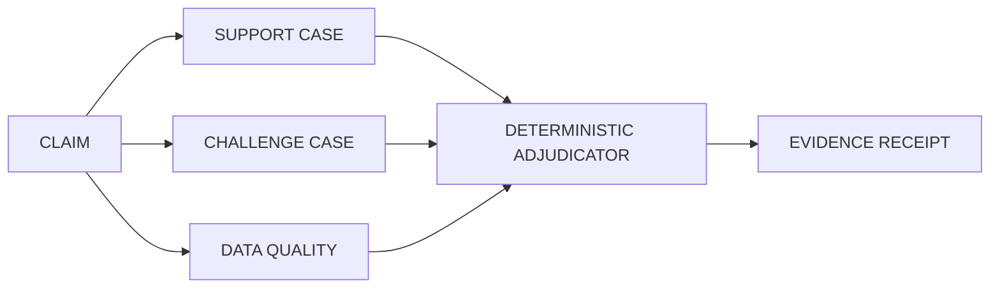
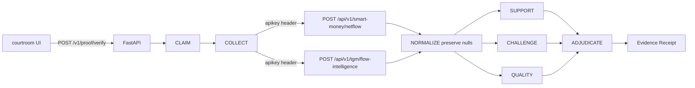

# Singulant Proof

**Don't ask AI to confirm your thesis. Make it try to break it.**

Adversarial on-chain verification powered by Nansen.

Live product: [https://www.thesingulant.ai/proof/](https://www.thesingulant.ai/proof/). This GitHub repository is source only.

Singulant Proof is an **adversarial verification system**. It is not a thesis checker. Meridian already has Thesis Desk — this is opposing counsel.

```
CLAIM
  → SUPPORT CASE + CHALLENGE CASE + DATA QUALITY
  → DETERMINISTIC ADJUDICATOR
  → EVIDENCE RECEIPT
```

Nansen evidence drives Support, Challenge, Quality, and the stamp. **The LLM cannot choose or override the verdict.**



## Not Thesis Desk

Thesis Desk asks whether the thesis holds. Singulant Proof puts one on-chain claim on the stand and tries to break it. Courtroom, not copilot. Cross-examination, not a dashboard.

## Demo: AAVE → CONTRADICTED

Default docket is **AAVE** on Ethereum (`0x7fc66500c84a76ad7e9c93437bfc5ac33e2ddae9`).

1. Start the API (steps below).
2. Open [http://127.0.0.1:8000](http://127.0.0.1:8000). AAVE is prefilled.
3. Click **ATTEMPT FALSIFICATION**.

Live Nansen Smart Money netflow + Token God Mode flow-intelligence feed Support, Challenge, and Quality. When Challenge dominates, the adjudicator stamps **CONTRADICTED**. That is the product working. We do not rubber-stamp accumulation.

## Clone and run (< 10 minutes)

Python 3.11+. You need a `NANSEN_API_KEY` for the live path (the demo judges should run).

```bash
git clone https://github.com/TheSingulant/singulant-proof.git
cd singulant-proof
python3 -m venv .venv
source .venv/bin/activate
pip install -e ".[dev]"
cp .env.example .env
```

Put `NANSEN_API_KEY` in `.env`. Never commit it.

```bash
set -a && source .env && set +a
uvicorn singulant_proof.api.app:app --reload --host 127.0.0.1 --port 8000
```

- UI: [http://127.0.0.1:8000](http://127.0.0.1:8000) — click **ATTEMPT FALSIFICATION**
- Health: `GET /healthz`
- Verify: `POST /v1/proof/verify`

```bash
curl -s http://127.0.0.1:8000/v1/proof/verify \
  -H 'Content-Type: application/json' \
  -d '{
    "chain": "ethereum",
    "token_address": "0x7fc66500c84a76ad7e9c93437bfc5ac33e2ddae9",
    "claim": "SMART_MONEY_IS_ACCUMULATING_THIS_TOKEN",
    "timeframe": "1d"
  }'
```

uvicorn serves the courtroom UI at the same origin: [http://127.0.0.1:8000](http://127.0.0.1:8000). That is the supported judge path. Production CORS is owned by nginx; the app does not emit CORS headers.

Without a key, live verify returns **503**. Optional env-only demo (API, not the UI): set `SINGULANT_PROOF_ALLOW_DEMO=1` and POST `{"demo": true}` — labeled synthetic evidence, not a Nansen observation.

## Tests

```bash
pytest
```

Live Nansen round-trip (skips unless the key is set):

```bash
NANSEN_API_KEY=... pytest tests/test_integration_live.py -q
```

A 7-surface Nansen stress corpus (1008 unique API calls) is evaluation evidence, not this product. See [Meridian evaluation](#meridian-evaluation). `scripts/nansen_eval.py` is a stub — do not run it here.

## What this is / is not

| This | Not this |
| --- | --- |
| Adversarial verification of one claim | Thesis checker / trade-thesis validator |
| Support vs Challenge vs Quality, then a stamp | AI research assistant |
| Evidence Receipt | Nansen dashboard |
| Courtroom / cross-examination | Generic token-analysis terminal |

V1 claim only:

> Smart Money is accumulating this token.

This repository is a public Buildathon surface. Zero imports of AI4 telegram TX, authorize/consume, handoff, V07, or R3. No trading, wallet, or transaction-authorization path. **Powered by Nansen.**

## Environment

| Variable | Required | Purpose |
| --- | --- | --- |
| `NANSEN_API_KEY` | For live verify | Sent as the `apikey` header to `https://api.nansen.ai` |
| `SINGULANT_PROOF_ALLOW_DEMO` | Optional | Allows `POST /v1/proof/verify` with `{"demo": true}` (synthetic docket; not in the public UI) |

Do not put keys in code, fixtures, README, logs, or commits.

## Pipeline (how Nansen is used)



Nansen is the only provider. Credit and rate-limit headers are stored as redacted provenance. Raw provider bodies are never returned. Hearing progress in the UI maps to `CLAIM → COLLECT → NORMALIZE → SUPPORT → CHALLENGE → QUALITY → ADJUDICATE → RECEIPT`.

## Endpoints used

| Provider | Method | Path | Role |
| --- | --- | --- | --- |
| Nansen | POST | `/api/v1/smart-money/netflow` | Primary accumulation evidence + `market_cap_usd` / `trader_count` / `token_age_days` context |
| Nansen | POST | `/api/v1/tgm/flow-intelligence` | Cohort support and challenge (`smart_trader`, `top_pnl`, `whale`, `exchange`, `fresh_wallets`, `public_figure`) |

Auth: header `apikey`. Base: `https://api.nansen.ai`. Client retries **429 / timeout / 5xx** only, with bounded exponential backoff.

Token screener (`/api/token-screener`) is a 404 — not used. V1 takes market-cap context from the netflow row.

## Meridian evaluation

Appendix — corpus coverage, not the product. Live demo: [https://www.thesingulant.ai/proof/](https://www.thesingulant.ai/proof/). Do not run the corpus from this repo (`scripts/nansen_eval.py` is a stub).

External **7-surface** Nansen stress corpus: **1008 unique API calls** (not 1008 complete Proofs) — **907** success / **101** failed (mostly flows `422` unsupported label×token; 2× `500`).

Production adjudicator still uses **only** `POST /api/v1/smart-money/netflow` and `POST /api/v1/tgm/flow-intelligence`. Other surfaces in that corpus are evaluation-only.

Offline determinism: **PASS**.

Live Proof coverage (examples):

- Prior engineering: **AAVE → CONTRADICTED**, **WIF → MIXED**
- Additional live: **AERO@base → SUPPORTED_BUT_CONTESTED**; **BONK → CONTRADICTED**; **JUP / RAY / WBNB → MIXED**

## Scoring

Documented in [`src/singulant_proof/proof/scoring.md`](src/singulant_proof/proof/scoring.md). Conservative. Same `EvidenceSet` → identical scores and verdict. The adjudicator is a first-match table, not a model.

- Nested netflow windows (`1h ⊂ 24h ⊂ 7d ⊂ 30d`) are **not** added as independent dollars.
- TGM `smart_trader` corroborates Smart Money; it is not summed with netflow.
- Independent cohorts use **max, not sum**.
- Nulls stay null.
- Challenge may conclude **NO MATERIAL CONTRADICTORY EVIDENCE DETECTED**.
- Verdicts: `SUPPORTED` · `SUPPORTED_BUT_CONTESTED` · `MIXED` · `CONTRADICTED` · `INSUFFICIENT_DATA`.

## API request

`POST /v1/proof/verify`

```json
{
  "chain": "ethereum",
  "token_address": "0x7fc66500c84a76ad7e9c93437bfc5ac33e2ddae9",
  "claim": "SMART_MONEY_IS_ACCUMULATING_THIS_TOKEN",
  "timeframe": "1d"
}
```

Response includes `claim`, `chain`, `token`, `stages_completed`, `support_case[]`, `challenge_case[]`, `support_strength`, `challenge_strength`, `data_quality`, `verdict`, `evidence_receipt`, `warnings`.

The Evidence Receipt is share-card-ready (`claim`, verdict, scores, `observed_at`, observation counts, attribution). There is no social share UI in V1.

## Limitations

- One claim. No freeform NL.
- No trading, wallets, TX auth, or contract calls.
- `exchange_wallet_count` is always 0; `fresh_wallets_*` only on `1d`/`7d`.
- Conservative adjudicator prefers `INSUFFICIENT_DATA` over a bullish stamp.
- Not investment advice. Nansen data can lag (see Nansen coverage notes).
- Isolated from AI4. Do not import it here.
